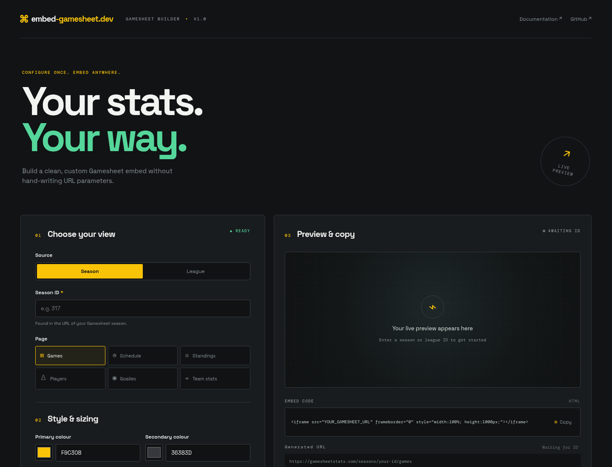
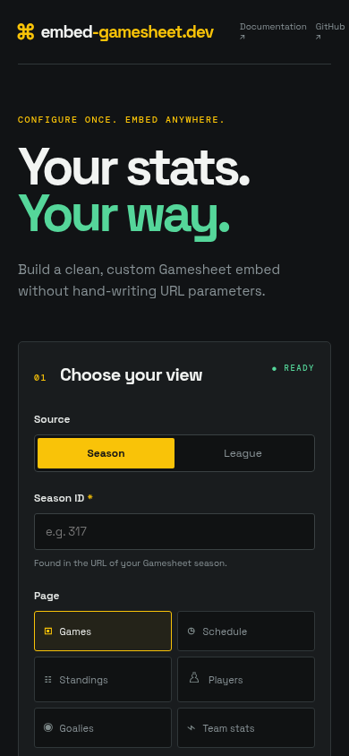

# embed-gamesheet.dev



A focused, client-side builder for creating [GameSheet](https://gamesheetstats.com/) scores, schedule, standings, and stats iframe embeds without hand-writing URL parameters.

## Live site

[embed-gamesheet.dev](https://www.embed-gamesheet.dev/)

## What it does

- Builds season or league embeds for games, schedules, standings, players, goalies, and team stats.
- Supports GameSheet colors, dimensions, visibility toggles, compact mode, links, filters, and infinite scroll.
- Exposes advanced division, team, query, game type, venue, position, column, sorting, and result-limit options.
- Generates copy-ready iframe HTML and a live preview once an ID is entered.
- Includes a tournament preset for standings, round-robin, and playoff embeds.

The layout also adapts for smaller screens:



## Local development

```bash
npm install
npm run dev
```

Open [http://localhost:3000](http://localhost:3000).

## Production build

```bash
npm run build
npm start
```

The project is a static-compatible Next.js app and can be deployed directly to Vercel.

## Project structure

| Path | Purpose |
| --- | --- |
| `app/page.tsx` | Builder state, controls, URL generation, preview, and copy actions |
| `app/globals.css` | Responsive visual system and component styling |
| `app/layout.tsx` | Metadata and root layout |
| `docs/screenshots/` | README product screenshots |

## Documentation

The supported embed parameters follow the [GameSheet embed documentation](https://help.gamesheet.app/article/10-scores-schedule-standings-stats-embed-tool).

## License

No license has been selected yet.
